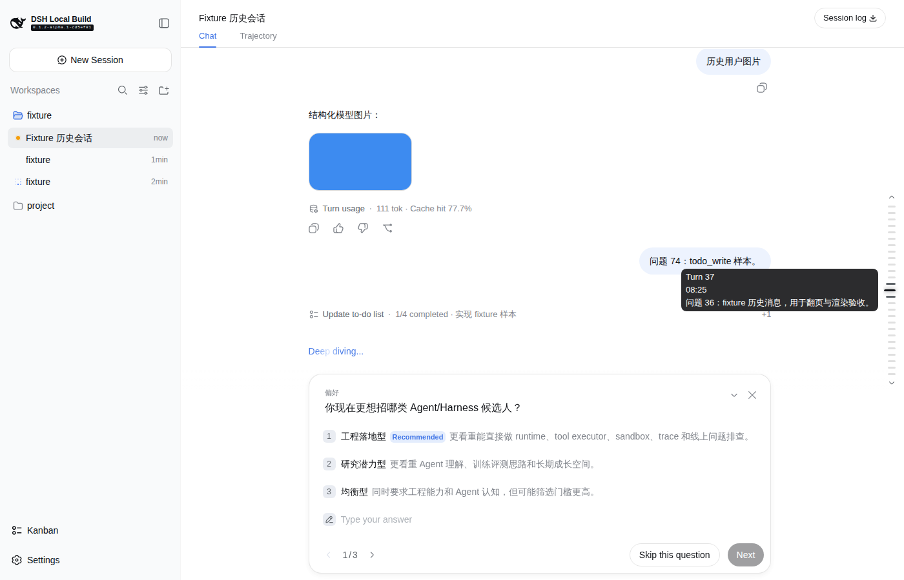

# dsh-turn-navigator

**English · [简体中文](README.zh.md)**

An external [DeepSeek Harness](https://github.com/deepseek-ai/deepseek-harness) plugin that adds a **piano-key turn rail** to the conversation interface — a vertical column of tiny capsules on the right edge of the conversation, one per turn, so you can see every turn at a glance, hover to preview it, and click to jump to its start.



## Why

In the default DSH web UI, finding a specific turn in a long conversation means scrolling — a lot. There's no overview of how many turns happened, what each turn was about, or where the current scroll position sits. `dsh-turn-navigator` solves this with a minimap-style rail:

- A **vertical capsule per turn** floats on the right edge of the conversation (grey, ~3px tall, piano-key style).
- **Hovering** a capsule makes it glow with the theme's primary label color and widen to 150% (the two neighbours widen to 125% too), so sliding across the rail ripples like a wave — and shows the full turn info (index, timestamp, user-message summary) in a native DSH tooltip.
- **Clicking** a capsule scrolls the conversation to that turn's start and briefly highlights it.
- **Every turn is shown as data, instantly**: the rail reads the full conversation history from the host (`sessions.history` RPC) as lightweight data — no prepends into the conversation flow, so even a 150-turn session opens without re-rendering the flow. Clicking a capsule for a turn outside the window extends the window on demand to reach it.

## Installation

```sh
dsh plugin --profile web add dsh-turn-navigator
```

Then restart `dsh web`:

```sh
dsh web
```

## Usage

1. Open any conversation with at least one completed turn.
2. A vertical rail of grey capsules appears on the right edge of the conversation (one capsule per turn). The rail **auto-sizes**: its length grows with the turn count, capped at **30vh** — a short conversation gets a short rail, a long one hits the cap and scrolls internally with a **hidden scrollbar** (no layout jitter). **Up/down scroll buttons** at its top and bottom support both click and **hover-hold auto-scroll**, and are greyed out when there is nothing to scroll in that direction — so the rail never stretches past the viewport, and you can wheel, click, or hold to move through the turns.
3. Hover a capsule to see the turn's index, timestamp, and user-message summary in a DSH-style tooltip anchored to the left of the rail, vertically centered on the hovered capsule and always fully inside the viewport. The capsule glows with the theme color and widens 150% LEFTWARDS (right-aligned — the right edge never moves), with the two neighbours widening a little too, a wave ripple across the rail.
4. Click a capsule to jump to that turn's start. If the turn is outside the conversation window, the rail shows immediate feedback — the clicked capsule pulses and a "Locating turn N…" bubble appears beside it — while the window is extended on demand; when the turn is in view it scrolls to it and briefly highlights the target row. The activated capsule also scrolls to the center of the rail unless it is the first or last turn.
5. Every turn is visible immediately (read from history as data, without loading the flow); clicking a turn outside the conversation window loads just enough history to reach it.

## How it works

The plugin registers **one additive slot** — **no DSH source code is modified**:

| Slot | Scope | Role |
|------|-------|------|
| `conversation.session.header.utilities` | session | The floating turn rail; reads `useSession` directly |

Because the rail is session-scoped, it reads the live `ConversationSnapshot` straight from the framework `useSession` kit and renders as `position: fixed` (so it does not occupy the header's flex row).

- **Turn extraction**: `chat.timeline.turnOrder` + `turns` map for boundaries; `chat.locations.getTurn(turn)` for each turn's node keys; the first `kind === 'user'` node's first text block for the summary; `turnTimings` for the timestamp. Turns without a user message fall back to their first node's kind.
- **Jump-to-turn**: locate the turn's first chat-node key, find the DOM row via `data-chat-anchor-key="<key>"`, compute its position in the `[data-conversation-scroll]` scrollport, and set `scrollTop` precisely (more predictable than `scrollIntoView`). If the target row is not yet rendered (older page not loaded), it auto-clicks the "Load earlier" button and retries until the row appears — no "scroll once first" friction.
- **History-as-data (no flow prepends on open)**: the conversation window only materializes a page of events as DOM, and extending it (`loadOlder`) re-renders the whole flow — expensive on long sessions. The rail instead reads the full persisted history through the browser→host `sessions.history` RPC (paged, incremental) and derives every turn as plain data, so opening a session never touches the flow DOM. **On demand**: clicking a capsule for a turn already in the window scrolls to it directly; for a turn outside the window, the rail extends the window page by page (clicking the "Load earlier" paging button, respecting its in-flight state) until that turn is in the window, then scrolls and highlights it — the only path that prepends into the flow, and it runs only when the user clicks.

## Compatibility

- DeepSeek Harness (dsh) with the web client (`dsh web`).
- Requires the `conversation.session.header.utilities` slot declaration (present in current DSH).

## License

MIT
